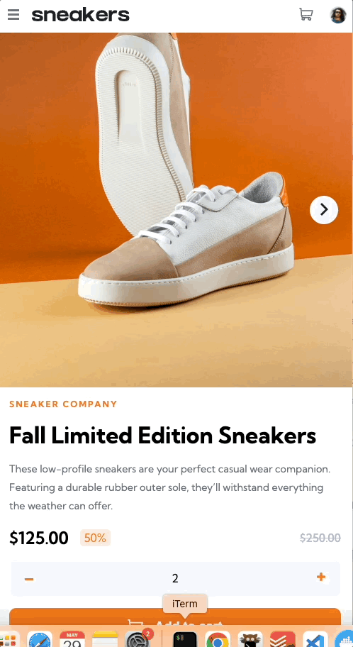
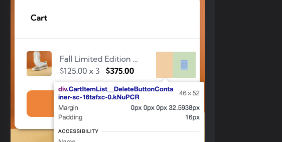
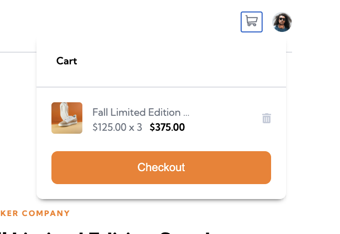

# E-commerce product page (React & Styled Components)


## Table of contents

- [Overview](#overview)
  - [The challenge](#the-challenge)
  - [Screenshot](#screenshot)
  - [Links](#links)
- [My process](#my-process)
  - [Built with](#built-with)
  - [What I learned](#what-i-learned)
  - [Useful resources](#useful-resources)
- [Author](#author)

### The challenge

Your challenge is to build out this e-commerce product page and get it looking as close to the design as possible.

You can use any tools you like to help you complete the challenge. So if you've got something you'd like to practice, feel free to give it a go.

Your users should be able to:

- View the optimal layout for the site depending on their device's screen size
- See hover states for all interactive elements on the page
- Open a lightbox gallery by clicking on the large product image
- Switch the large product image by clicking on the small thumbnail images
- Add items to the cart
- View the cart and remove items from it

### Screeshot



### Links

- Solution URL: [https://github.com/EthanChenYen-Peng/ecommerce-product-page](https://github.com/EthanChenYen-Peng/ecommerce-product-page)
- Live Site URL: [https://ecommerce-product-page-nine-beryl.vercel.app/](https://ecommerce-product-page-nine-beryl.vercel.app/)

## My process

### Built with

- Mobile-first workflow
- Typescript
- [Redux toolkit](https://redux-toolkit.js.org/) For state management
- [React](https://reactjs.org/) - JS library
- [Styled-Components](https://styled-components.com/) - CSS in JS library


### What I learned
1. Import SVG as React component using Parcel.
References:
  * https://parceljs.org/languages/svg/#importing-as-a-react-component
  * https://stackoverflow.com/questions/61944964/how-do-you-use-an-svg-inline-in-react-using-parcel-2
```shell
npm i -D @parcel/transformer-svg-react
```

`.parcelrc`
```json
{
  "extends": "@parcel/config-default",
  "transformers": {
    "jsx:*.svg": ["...", "@parcel/transformer-svg-react"],
    "jsx:*": ["..."]
  }
}
```
2. Use CSS `calc` property to dynamically calculate the amount to slide when changing the image.
```tsx
const ImageContainer = styled.div<{ currentImageIndex: number }>`
  display: flex;
  overflow: hidden;
  img {
    object-fit: cover;
    max-height: 600px;
    width: 100%;
    display: block;
    transform: ${(props) =>
      `translateX(calc(-100% * ${props.currentImageIndex}))`};
    transition: transform 0.3s;
  }
`
```

3. Use padding and transform translate to increasing the button area without changing the icon size.

```tsx
const DeleteButtonContainer = styled.div`
  margin-left: auto;
  /* Bigger pressing area */
  padding: 1rem;
  transform: translateX(1rem);
  cursor: pointer;
`
```

4. Use opacity and pointer event to toggle pop-up.

```jsx
const Container = styled.div<{ open: boolean }>`
  opacity: ${(props) => (props.open ? '1' : '0')};
  transform: ${(props) => (props.open ? 'translateY(0%)' : 'translateY(30px)')};
  transition: transform 0.5s, opacity 0.3s;
  pointer-events: ${(props) => (props.open ? '' : 'none')};
  position: absolute;
  width: 95%;
  max-width: 400px;
  min-height: 200px;
  background-color: white;
  border-radius: 10px;
  top: 60px;
  right: 10px;
  z-index: 2;
  box-shadow: 0px 5px 8px -6px #000000;
`
```
